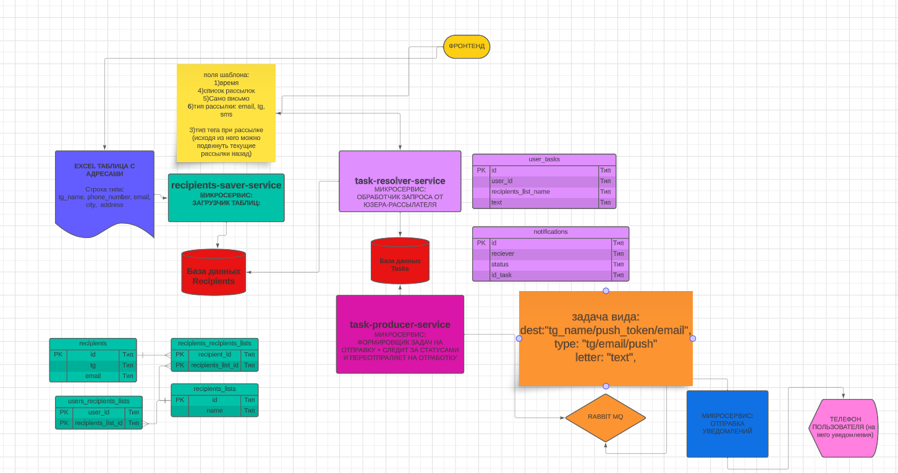
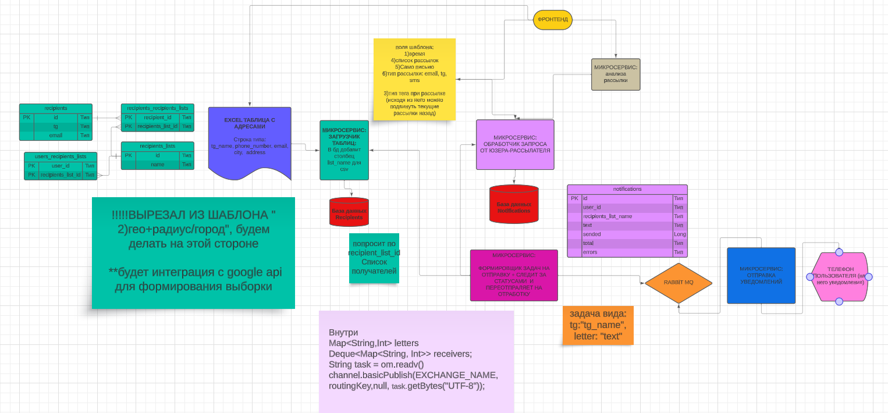
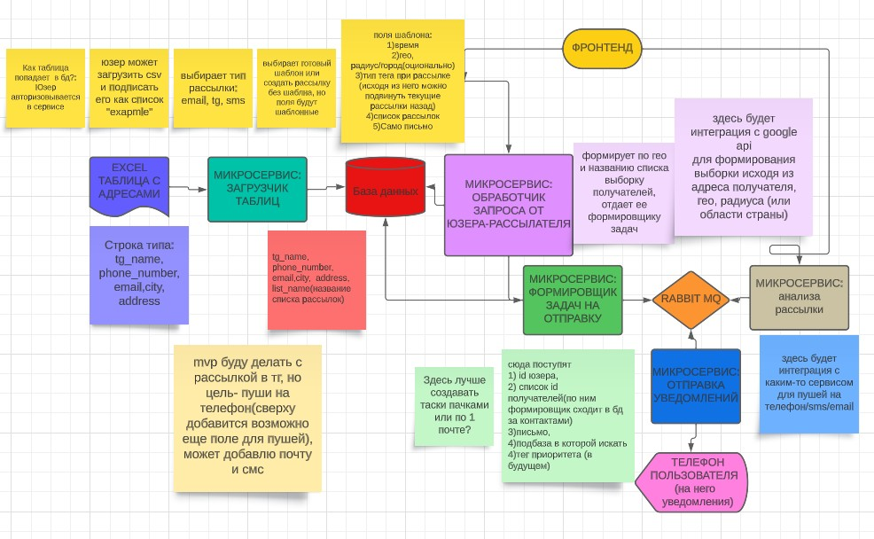
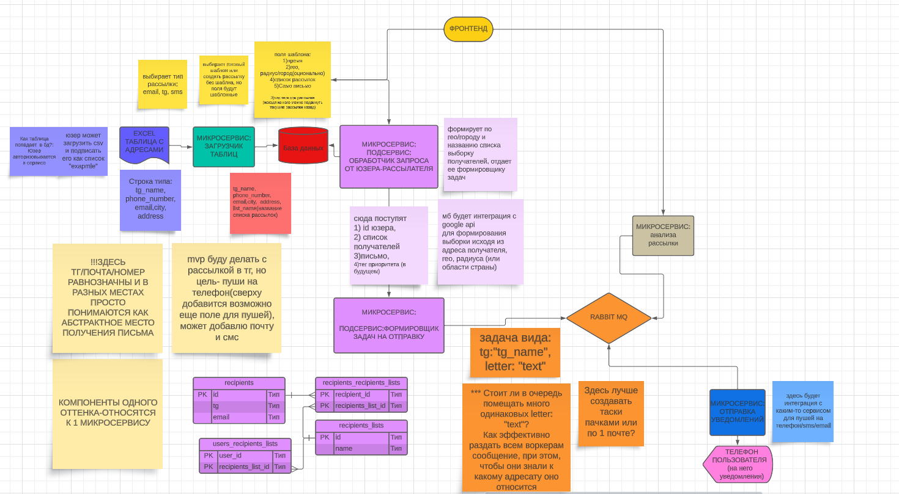

# Сервис экстренного предупреждения - Emergency Notification System.

## Описание сервиса/требования:

* Пример задачи: задача уровня государства - разослать уведомления какой-либо области (а это миллионы людей) о сильном ветре или бедствии стихийном. 
* Гарантия доставки сообщения - at least once.
* Вот пример работы такой службы, созданной правительством UK. (https://www.youtube.com/shorts/JzNx8oa82s8) (осторожно, громко)
* Если не выйдет с apple push, то попробую с android/tg.
## Наброски для архитектуры


## Old versions
### v4
#### до 4 версии вообще не стоит смотреть, там полный бред.
#### идеи для 4:
***
* recipients-saver-service и task-resolver-service стоит объединить, т.к иначе для введения системы статусов придется копировать по N recievers, где N может достигать миллионов, что по REST долго и небезопасно, и даже если я разрешу ходить к бд recipients-saver-service, все же много копировать + это не нормально ходить в чужую бд.
* я выстроил систему с брокером по докладу по transactional outbox о Lamoda, но многие сказали, что это не совсем outbox. По итогу мы имеем 2 персистентных хранилища вместо одного. Смысл rabbit mq в моем случае теряется, тк очередь придется выстраивать и на стороне БД для outbox процессора(task-producer-service)
* я нашел еще один вариант outbox - ``` @Transactional
public SaleId createWidget(Sale sale) {
  var saleId = saleRepository.save(sale);
  messageQueue.saveMessage(StockReductionEvent.of(sale.item(), sale.amount()));
  return saleId;
}```
но он мне также не подходит - отправить большое сообщение в котором пара миллионов строк не имеет смысла - мне нужно отследить статус каждого, а по одному в течение одной транзации проблемно - что если одно потеряется? Придется снова проводить транзакцию и снова помешать все N сообщений в брокер - будут дубликаты, нужно будет реализовывать idempotency consumer, хранить id обработанных, много дубликатов будут засорять брокер.
* Почему бы notification-sender-service самостоятельно не опрашивать табличку outbox? - Вроде ок, очередь можно выстроить через БД с FOR UPDATE
* Почему бы здесь не использовать redis для размещения тасок - ускорим чтение тасок? Не понятно как выстраивать очередь в таком случае, но стоит обдумать


### v3

### v2

### v1

